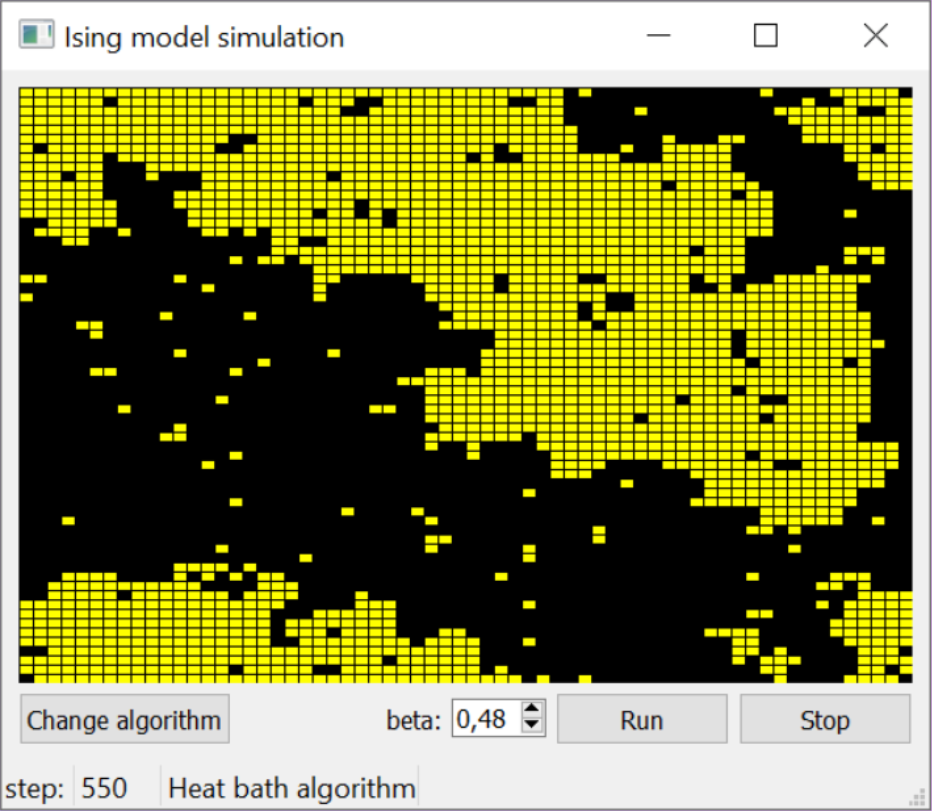

# Ising model simulation on C++, Qt 5.14.1

Семестровый проект по информатике студентов МФТИ Бондаря Р, Семененко А, Пяткина С.

## Параметры командной строки
Скомпилированный файл ising_model.exe (или просто ising_model в linux) позволяет делать две вещи:
1) Запустить симуляцию модели Изинга в графическом режиме. 
  Синтаксис: `ising_model.exe [option]` 
  При запуске без параметров размер решетки по умолчанию будет 64x64 (пример на картинке выше). Использование опции `-lsize=<number>` позволяет задать размер до запуска.

2) Построить график средней намагниченности решетки от температуры beta. В каждом измерении спины вначале ориентированы произвольно, и средняя намагниченность берется через steps шагов алгоритма. 
    Синтаксис: `ising_model.exe -plot input output [plot options]`. 
    Точки для построения графика (значения beta) берутся из файла с именем input, а результаты (средняя намагниченность avg_magn) записываются в файл output. Формат входа: сначала количество точек n, затем n значений. 
    Размер решетки можно выбрать опцией `-lsize=<number>`. 
    Используемый алгоритм выбирается опцией `-algo=<1|2>`, где 1 - Heat bath algorithm, 2 - Clusters algorithm. 
    Число шагов steps алгоритма задается с помощью `-steps=<number>`. 
    Рекомендуется также использовать усреднение результатов. Каждая точка усредняется averaging число раз, его можно задать опцией `-avg=<number>`. При построении обоих графиков выше усреднение происходило по 50.

Пример команды для запуска с GUI: 
`ising_model.exe -lsize=100 -algo=1` 
Пример команды для запуска без GUI: 
`ising_model.exe -plot input.txt output.txt -steps=200 -algo=1 -avg=50` 
Пример входных данных: `5 0.3 0.4 0.5 0.6 0.7`
    
## Building under Windows 10:
1) qmake
2) make
3) windeployqt .
4) ising_model.exe

## Building under Linux:
1) qmake
2) make
3) ./ising_model

## Usage and command line options:
For simulation with GUI: `ising_model [options]`

For plot making (in console without GUI): `ising_model -plot input output [plot options]`

For more information: `ising_model -help`

License: GNU GPL
